# Manual Técnico — BioCore Medical System

> Sistema Integral de Gestión Hospitalaria  
> Versión 2.2 · Angular 17 + Spring Boot 3.3.6 + PostgreSQL

---

## Tabla de Contenidos

1. [Herramientas y Tecnologías](#1-herramientas-y-tecnologías)
2. [Versionado en GitHub](#2-versionado-en-github)
3. [Descripción del Sistema](#3-descripción-del-sistema)
4. [Estructura de Módulos](#4-estructura-de-módulos)
5. [Diagrama de Clases](#5-diagrama-de-clases)
6. [Diagramas de Secuencia](#6-diagramas-de-secuencia)
7. [Base de Datos](#7-base-de-datos)
8. [Diagrama de Despliegue](#8-diagrama-de-despliegue)

---

## 1. Herramientas y Tecnologías

### 1.1 Frontend

| Herramienta | Versión | Propósito |
|-------------|---------|-----------|
| Angular | 17.0.0 | Framework SPA principal |
| TypeScript | 5.2.0 | Lenguaje tipado |
| Angular Material (MDC) | 17.0.0 | Componentes UI |
| Angular Signals | 17.0.0 | Estado reactivo del usuario |
| RxJS | 7.8.0 | Programación reactiva / observables |
| SCSS (Sass) | integrado | Preprocesador CSS |
| Angular CLI | 17.0.0 | Scaffolding y build |
| Node.js | 18+ | Runtime de desarrollo |
| npm | — | Gestor de paquetes |
| Jasmine + Karma | 5.1 / 6.4 | Testing unitario |

#### Dependencias de producción
```
@angular/animations        ^17.0.0
@angular/cdk               ^17.0.0
@angular/common            ^17.0.0
@angular/core              ^17.0.0
@angular/forms             ^17.0.0
@angular/material          ^17.0.0
@angular/router            ^17.0.0
rxjs                       ~7.8.0
zone.js                    ~0.14.0
```

#### Dependencias de desarrollo
```
@angular-devkit/build-angular  ^17.0.0
@angular/cli                   ^17.0.0
@angular/compiler-cli          ^17.0.0
@types/jasmine                 ~5.1.0
jasmine-core                   ~5.1.0
karma                          ~6.4.0
karma-chrome-launcher          ~3.2.0
karma-coverage                 ~2.2.0
typescript                     ~5.2.0
```

### 1.2 Backend

| Herramienta | Versión | Propósito |
|-------------|---------|-----------|
| Spring Boot | 3.3.6 | Framework de aplicación |
| Java | 17 | Lenguaje de programación |
| Apache Maven | 3.x | Build y gestión de dependencias |
| Spring Data JPA | — | ORM / acceso a datos |
| Hibernate | — | Implementación JPA |
| Spring Security | — | Autenticación y autorización |
| JJWT | 0.12.6 | Generación y validación JWT |
| Lombok | — | Reducción de boilerplate |
| Spring Mail | — | Envío de correos SMTP |
| PostgreSQL Driver | — | Conector JDBC |

### 1.3 Base de Datos e Infraestructura

| Herramienta | Rol |
|-------------|-----|
| PostgreSQL | Motor de base de datos relacional |
| Neon Cloud | Hosting serverless de PostgreSQL |
| Railway | Hosting de backend Spring Boot y frontend |
| Gmail SMTP | Envío de notificaciones por correo |

### 1.4 Herramientas de Desarrollo

| Herramienta | Uso |
|-------------|-----|
| Git | Control de versiones |
| GitHub | Repositorio remoto y colaboración |
| VS Code | IDE Frontend |
| IntelliJ IDEA / Eclipse | IDE Backend |

---

## 2. Versionado en GitHub

### 2.1 Repositorio

| Campo | Valor |
|-------|-------|
| URL | https://github.com/jMoscut/Hospital_Ing_Software |
| Rama principal | `main` |
| Estrategia | Commits por versión en rama única |

### 2.2 Historial de versiones

| Hash | Versión | Descripción |
|------|---------|-------------|
| `68c0e4a` | **2.2** | Versión actual — correcciones UI y flujos finales |
| `7ddfaf8` | 2.1.1 | Hotfix post-versión 2.1 |
| `9304fee` | 2.1 | Mejoras funcionales |
| `a86081b` | 2.0.1 | Corrección de errores versión 2.0 |
| `01d9db1` | 2.0 | Refactorización mayor de módulos |
| `67cf739` | 1.9 | Módulo de laboratorio completo |
| `0659ee9` | 1.8 | Módulo de farmacia |
| `cf39d67` | 1.7 | Módulo de pagos y caja |
| `2400911` | 1.6 | Módulo de emergencias |
| `3a1d48d` | Deploy | Backend desplegado en Railway |
| `047952a` | Deploy | Frontend desplegado en Railway |
| `f6843fb` | 1.5 | Módulo de consulta médica |
| `d65e6f0` | 1.4 | Módulo de recepción y cola |

### 2.3 Convención de commits

Los commits siguen el patrón `Versión X.Y` o `Deploy [componente]`, indicando hitos funcionales completos más que cambios individuales.

---

## 3. Descripción del Sistema

### 3.1 Propósito

BioCore Medical es un sistema integral de gestión hospitalaria desarrollado para digitalizar y automatizar los procesos clínicos y administrativos de un hospital. Cubre desde la recepción del paciente hasta la entrega de resultados de laboratorio, despacho de medicamentos y gestión de pagos.

### 3.2 Usuarios del sistema

| Rol | Descripción | Accesos principales |
|-----|-------------|---------------------|
| `ADMIN` | Administrador del sistema | Todo + reportería + gestión de personal |
| `HEALTH_STAFF` | Personal de salud / Recepcionista / Enfermería | Recepción, cola, signos vitales, emergencias |
| `DOCTOR` | Médico (clínica normal) | Consulta médica, prescripciones, órdenes de lab |
| `DOCTOR` (emergencia) | Médico de emergencias | Emergencias médicas, reportes clínicos |
| `LAB_TECHNICIAN` | Laboratorista | Órdenes de laboratorio, resultados |
| `PHARMACIST` | Farmacéutico | Inventario, ventas, despacho de recetas |
| `CASHIER` | Cajero | Pagos, citas, facturación |
| `PATIENT` | Paciente | Portal de citas y resultados propios |

### 3.3 Reglas de negocio principales

| Código | Regla |
|--------|-------|
| RN-P003 | Usuario con contraseña temporal debe cambiarla en el primer inicio de sesión |
| RN-M01 | Cada clínica tiene un máximo de doctores asignados |
| RN-M02 | Un doctor solo puede estar activo en una clínica a la vez |
| RN-03 | Signos vitales son obligatorios antes de pasar al médico |
| RN-C01 | Pacientes URGENTES van al frente de la cola |
| RN-L01 | Órdenes de laboratorio tienen validez de 30 días |
| RN-L02 | Notificación por correo cuando resultados de lab están disponibles |
| RN-F01 | Stock de medicamentos debe actualizarse en cada venta |
| RN-F02 | Medicamento de prescripción solo se despacha tras pago confirmado |
| RN-P01 | Descuento por seguro se aplica automáticamente al calcular pago |
| RN-P02 | `netAmount = amount - discountAmount` |
| RN-R03 | Dashboard se actualiza cada 10 segundos en tiempo real |
| RN-05 | Documentos adjuntos solo en formato PDF, máximo 20 MB |

---

## 4. Estructura de Módulos

### 4.1 Frontend — Angular 17

```
biocore-frontend/src/
├── environments/
│   ├── environment.ts              # apiUrl dev (localhost:8085)
│   └── environment.prod.ts         # apiUrl producción (Railway)
├── styles.scss                     # Paleta Bosque + overrides Angular Material
└── app/
    ├── app.component.ts            # Shell: sidenav + topbar + router-outlet
    ├── app.routes.ts               # Tabla de rutas con authGuard
    │
    ├── core/
    │   ├── auth/
    │   │   └── auth.service.ts         # JWT, login, logout, Signals
    │   ├── guards/
    │   │   └── auth.guard.ts           # CanActivateFn
    │   ├── interceptors/
    │   │   └── auth.interceptor.ts     # Inyección Bearer token
    │   └── models/
    │       ├── api-response.model.ts
    │       ├── user.model.ts
    │       ├── patient.model.ts
    │       ├── ticket.model.ts
    │       ├── lab.model.ts
    │       └── payment.model.ts
    │
    ├── shared/
    │   └── services/
    │       ├── patient.service.ts
    │       ├── ticket.service.ts       # + ClinicService, AppointmentService,
    │       │                           #   VitalSignsService, DoctorScheduleService
    │       ├── lab.service.ts          # + LabExamService, MedicineService,
    │       │                           #   PrescriptionService, PharmacySaleService
    │       ├── payment.service.ts      # + ReportService, UserService,
    │       │                           #   EmergencyService, InsuranceService
    │       └── notification.service.ts
    │
    └── modules/
        ├── portal/
        │   ├── portal.component.ts             # Landing pública
        │   ├── login/login.component.ts
        │   └── dashboard/dashboard.component.ts
        ├── patient/
        │   ├── patient-list/
        │   ├── patient-detail/
        │   └── patient-register/
        ├── appointments/appointments.component.ts
        ├── health-staff/health-staff.component.ts
        ├── consultation/consultation.component.ts
        ├── emergency/emergency.component.ts
        ├── emergency-consultation/emergency-consultation.component.ts
        ├── laboratory/laboratory.component.ts
        ├── pharmacy/pharmacy.component.ts
        ├── payments/payments.component.ts
        ├── user-management/user-management.component.ts
        ├── reporting/reporting.component.ts
        ├── public-register/public-register.component.ts
        ├── mis-citas/mis-citas.component.ts
        └── call-screen/call-screen.component.ts
```

### 4.2 Rutas del Frontend

| Ruta | Componente | Auth | Roles |
|------|------------|------|-------|
| `/` | — | No | Redirige a `/portal` |
| `/portal` | PortalComponent | No | Público |
| `/login` | LoginComponent | No | Público |
| `/register` | PublicRegisterComponent | No | Público |
| `/dashboard` | DashboardComponent | Sí | Todos |
| `/patients` | PatientListComponent | Sí | Todos |
| `/patients/register` | PatientRegisterComponent | Sí | Todos |
| `/patients/:id` | PatientDetailComponent | Sí | Todos |
| `/users` | UserManagementComponent | Sí | ADMIN |
| `/consultation` | ConsultationComponent | Sí | DOCTOR |
| `/emergency-consultation` | EmergencyConsultationComponent | Sí | DOCTOR (emergencia) |
| `/laboratory` | LaboratoryComponent | Sí | LAB_TECHNICIAN |
| `/pharmacy` | PharmacyComponent | Sí | PHARMACIST |
| `/payments` | PaymentsComponent | Sí | CASHIER |
| `/emergency` | EmergencyComponent | Sí | HEALTH_STAFF |
| `/health-staff` | HealthStaffComponent | Sí | HEALTH_STAFF |
| `/appointments` | AppointmentsComponent | Sí | Todos |
| `/reports` | ReportingComponent | Sí | ADMIN |
| `/mis-citas` | MisCitasComponent | Sí | PATIENT |
| `/call-screen` | CallScreenComponent | Sí | — |

### 4.3 Backend — Spring Boot 3.3.6

```
biocore-backend/src/main/java/com/biocore/
├── BiocoreApplication.java
├── config/
│   ├── DataInitializer.java       # Datos semilla (roles, clínicas, exámenes)
│   ├── SchemaMigrationRunner.java # Migraciones de esquema
│   └── SecurityConfig.java        # Spring Security + CORS + JWT filter
├── controller/                    # REST Controllers (20 clases)
│   ├── AuthController.java             POST /auth/login
│   ├── PatientController.java          /patients/**
│   ├── UserController.java             /users/**
│   ├── TicketController.java           /tickets/**
│   ├── ClinicController.java           /clinics/**
│   ├── AppointmentController.java      /appointments/**
│   ├── VitalSignsController.java       /vital-signs/**
│   ├── LabController.java              /lab-orders/**
│   ├── LabExamController.java          /lab-exams/**
│   ├── MedicineController.java         /medicines/**
│   ├── PrescriptionController.java     /prescriptions/**
│   ├── PharmacySaleController.java     /pharmacy/sales/**
│   ├── PaymentController.java          /payments/**
│   ├── EmergencyController.java        /emergency/**
│   ├── ReportController.java           /reports/**
│   ├── InsuranceController.java        /insurances/**
│   ├── ClinicScheduleController.java   /clinic-schedules/**
│   ├── DoctorScheduleController.java   /schedules/**
│   ├── DocumentController.java         /appointments/{id}/documents
│   └── PublicController.java           /public/**
├── model/          # 23 entidades JPA
├── repository/     # Interfaces Spring Data JPA
├── service/        # Lógica de negocio
├── dto/            # Request/Response DTOs
└── security/       # JwtProvider, JwtFilter, UserDetailsService
```

---

## 5. Diagrama de Clases

### 5.1 Dominio principal (Backend — Entidades JPA)

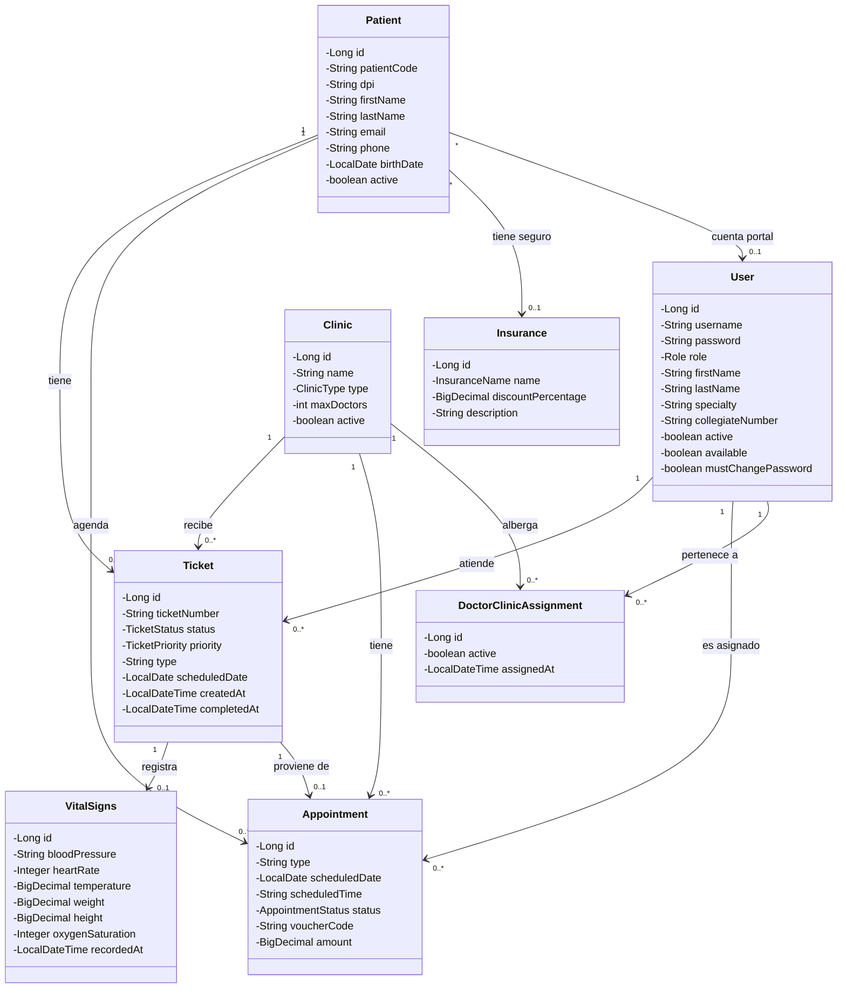
```mermaid
classDiagram
    class User {
        -Long id
        -String username
        -String password
        -Role role
        -String firstName
        -String lastName
        -String specialty
        -String collegiateNumber
        -boolean active
        -boolean available
        -boolean mustChangePassword
    }

    class Patient {
        -Long id
        -String patientCode
        -String dpi
        -String firstName
        -String lastName
        -String email
        -String phone
        -LocalDate birthDate
        -boolean active
    }

    class Insurance {
        -Long id
        -InsuranceName name
        -BigDecimal discountPercentage
        -String description
    }

    class Clinic {
        -Long id
        -String name
        -ClinicType type
        -int maxDoctors
        -boolean active
    }

    class DoctorClinicAssignment {
        -Long id
        -boolean active
        -LocalDateTime assignedAt
    }

    class Ticket {
        -Long id
        -String ticketNumber
        -TicketStatus status
        -TicketPriority priority
        -String type
        -LocalDate scheduledDate
        -LocalDateTime createdAt
        -LocalDateTime completedAt
    }

    class VitalSigns {
        -Long id
        -String bloodPressure
        -Integer heartRate
        -BigDecimal temperature
        -BigDecimal weight
        -BigDecimal height
        -Integer oxygenSaturation
        -LocalDateTime recordedAt
    }

    class Appointment {
        -Long id
        -String type
        -LocalDate scheduledDate
        -String scheduledTime
        -AppointmentStatus status
        -String voucherCode
        -BigDecimal amount
    }

    Patient "1" --> "0..*" Ticket : tiene
    Patient "1" --> "0..*" Appointment : agenda
    Patient "*" --> "0..1" Insurance : tiene seguro
    Patient "*" --> "0..1" User : cuenta portal

    User "1" --> "0..*" Ticket : atiende
    User "1" --> "0..*" Appointment : es asignado
    User "1" --> "0..*" DoctorClinicAssignment : pertenece a

    Clinic "1" --> "0..*" Ticket : recibe
    Clinic "1" --> "0..*" Appointment : tiene
    Clinic "1" --> "0..*" DoctorClinicAssignment : alberga

    Ticket "1" --> "0..1" VitalSigns : registra
    Ticket "1" --> "0..1" Appointment : proviene de
```

### 5.2 Módulo Clínico (Prescripciones y Laboratorio)

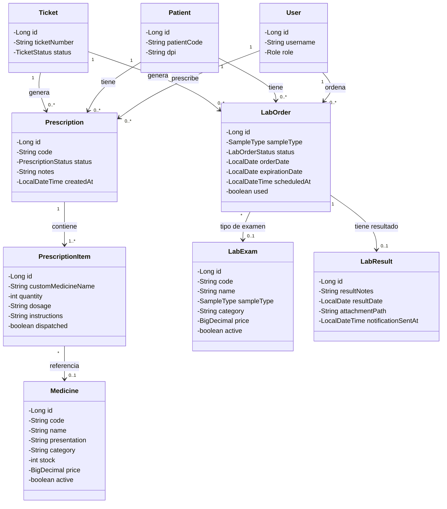
```mermaid
classDiagram
    class Prescription {
        -Long id
        -String code
        -PrescriptionStatus status
        -String notes
        -LocalDateTime createdAt
    }

    class PrescriptionItem {
        -Long id
        -String customMedicineName
        -int quantity
        -String dosage
        -String instructions
        -boolean dispatched
    }

    class Medicine {
        -Long id
        -String code
        -String name
        -String presentation
        -String category
        -int stock
        -BigDecimal price
        -boolean active
    }

    class LabOrder {
        -Long id
        -SampleType sampleType
        -LabOrderStatus status
        -LocalDate orderDate
        -LocalDate expirationDate
        -LocalDateTime scheduledAt
        -boolean used
    }

    class LabExam {
        -Long id
        -String code
        -String name
        -SampleType sampleType
        -String category
        -BigDecimal price
        -boolean active
    }

    class LabResult {
        -Long id
        -String resultNotes
        -LocalDate resultDate
        -String attachmentPath
        -LocalDateTime notificationSentAt
    }

    class Ticket {
        -Long id
        -String ticketNumber
        -TicketStatus status
    }

    class Patient {
        -Long id
        -String patientCode
        -String dpi
    }

    class User {
        -Long id
        -String username
        -Role role
    }

    Ticket "1" --> "0..*" Prescription : genera
    Ticket "1" --> "0..*" LabOrder : genera

    Patient "1" --> "0..*" Prescription : tiene
    Patient "1" --> "0..*" LabOrder : tiene

    User "1" --> "0..*" Prescription : prescribe
    User "1" --> "0..*" LabOrder : ordena

    Prescription "1" --> "1..*" PrescriptionItem : contiene
    PrescriptionItem "*" --> "0..1" Medicine : referencia

    LabOrder "*" --> "0..1" LabExam : tipo de examen
    LabOrder "1" --> "0..1" LabResult : tiene resultado
```

### 5.3 Módulo Financiero (Pagos y Farmacia)

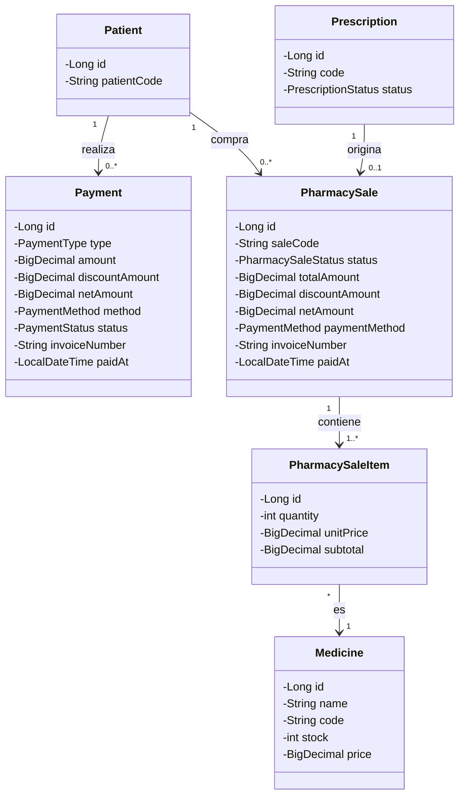
```mermaid
classDiagram
    class Payment {
        -Long id
        -PaymentType type
        -BigDecimal amount
        -BigDecimal discountAmount
        -BigDecimal netAmount
        -PaymentMethod method
        -PaymentStatus status
        -String invoiceNumber
        -LocalDateTime paidAt
    }

    class PharmacySale {
        -Long id
        -String saleCode
        -PharmacySaleStatus status
        -BigDecimal totalAmount
        -BigDecimal discountAmount
        -BigDecimal netAmount
        -PaymentMethod paymentMethod
        -String invoiceNumber
        -LocalDateTime paidAt
    }

    class PharmacySaleItem {
        -Long id
        -int quantity
        -BigDecimal unitPrice
        -BigDecimal subtotal
    }

    class Medicine {
        -Long id
        -String name
        -String code
        -int stock
        -BigDecimal price
    }

    class Patient {
        -Long id
        -String patientCode
    }

    class Prescription {
        -Long id
        -String code
        -PrescriptionStatus status
    }

    Patient "1" --> "0..*" Payment : realiza
    Patient "1" --> "0..*" PharmacySale : compra

    Prescription "1" --> "0..1" PharmacySale : origina

    PharmacySale "1" --> "1..*" PharmacySaleItem : contiene
    PharmacySaleItem "*" --> "1" Medicine : es
```

### 5.4 Módulo Emergencias

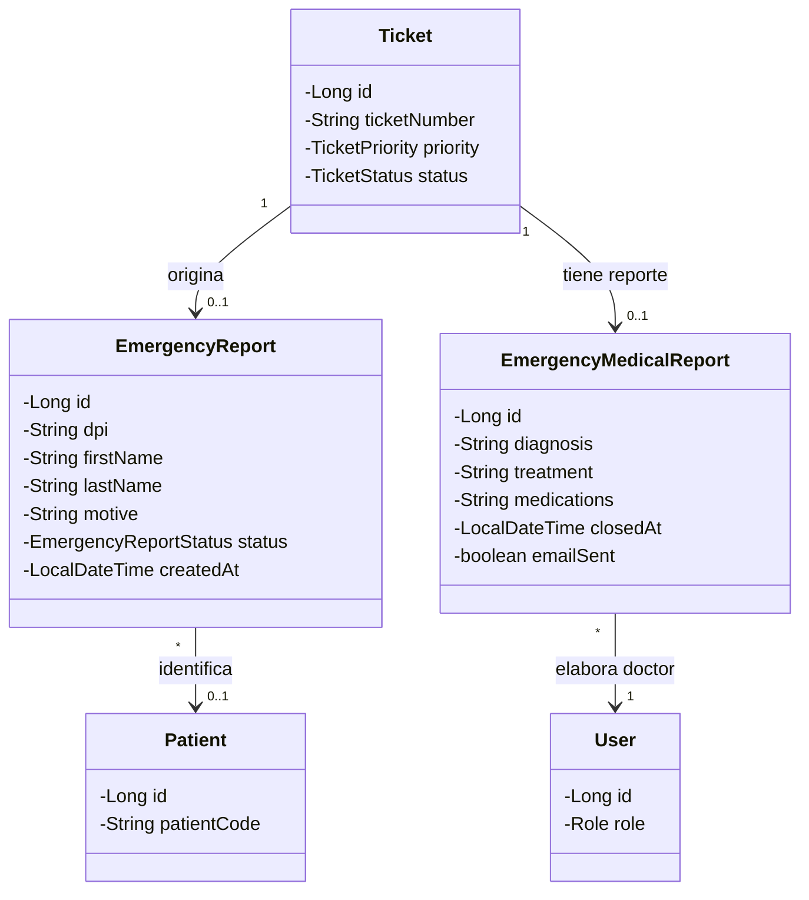
```mermaid
classDiagram
    class EmergencyReport {
        -Long id
        -String dpi
        -String firstName
        -String lastName
        -String motive
        -EmergencyReportStatus status
        -LocalDateTime createdAt
    }

    class EmergencyMedicalReport {
        -Long id
        -String diagnosis
        -String treatment
        -String medications
        -LocalDateTime closedAt
        -boolean emailSent
    }

    class Ticket {
        -Long id
        -String ticketNumber
        -TicketPriority priority
        -TicketStatus status
    }

    class Patient {
        -Long id
        -String patientCode
    }

    class User {
        -Long id
        -Role role
    }

    Ticket "1" --> "0..1" EmergencyReport : origina
    Ticket "1" --> "0..1" EmergencyMedicalReport : tiene reporte

    EmergencyReport "*" --> "0..1" Patient : identifica
    EmergencyMedicalReport "*" --> "1" User : elabora doctor
```

### 5.5 Servicios Angular (Frontend)

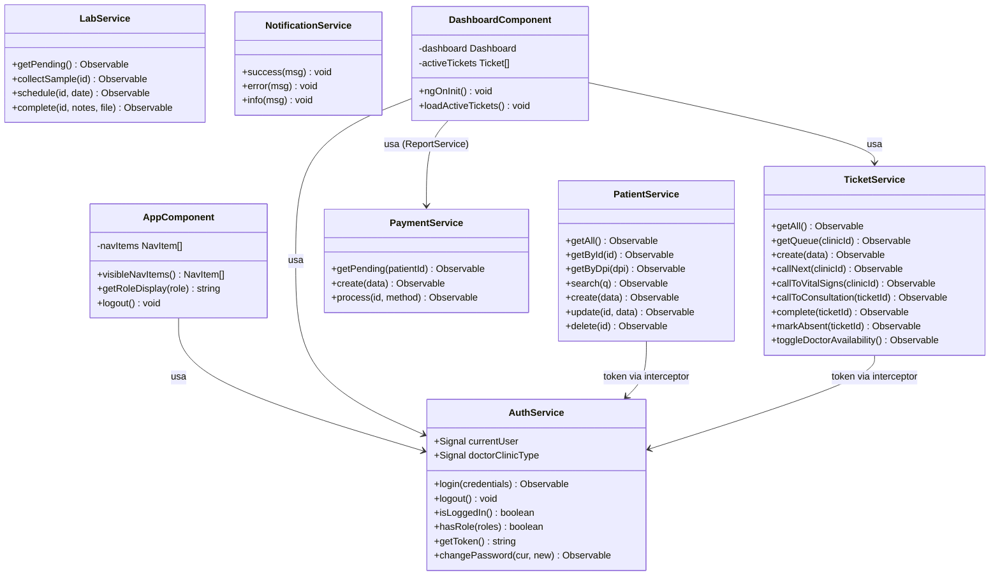
```mermaid
classDiagram
    class AuthService {
        +Signal currentUser
        +Signal doctorClinicType
        +login(credentials) Observable
        +logout() void
        +isLoggedIn() boolean
        +hasRole(roles) boolean
        +getToken() string
        +changePassword(cur, new) Observable
    }

    class PatientService {
        +getAll() Observable
        +getById(id) Observable
        +getByDpi(dpi) Observable
        +search(q) Observable
        +create(data) Observable
        +update(id, data) Observable
        +delete(id) Observable
    }

    class TicketService {
        +getAll() Observable
        +getQueue(clinicId) Observable
        +create(data) Observable
        +callNext(clinicId) Observable
        +callToVitalSigns(clinicId) Observable
        +callToConsultation(ticketId) Observable
        +complete(ticketId) Observable
        +markAbsent(ticketId) Observable
        +toggleDoctorAvailability() Observable
    }

    class LabService {
        +getPending() Observable
        +collectSample(id) Observable
        +schedule(id, date) Observable
        +complete(id, notes, file) Observable
    }

    class PaymentService {
        +getPending(patientId) Observable
        +create(data) Observable
        +process(id, method) Observable
    }

    class NotificationService {
        +success(msg) void
        +error(msg) void
        +info(msg) void
    }

    class AppComponent {
        -navItems NavItem[]
        +visibleNavItems() NavItem[]
        +getRoleDisplay(role) string
        +logout() void
    }

    class DashboardComponent {
        -dashboard Dashboard
        -activeTickets Ticket[]
        +ngOnInit() void
        +loadActiveTickets() void
    }

    AppComponent --> AuthService : usa
    DashboardComponent --> AuthService : usa
    DashboardComponent --> TicketService : usa
    DashboardComponent --> PaymentService : usa (ReportService)
    PatientService --> AuthService : token via interceptor
    TicketService --> AuthService : token via interceptor
```

---

## 6. Diagramas de Secuencia

### 6.1 Autenticación y Login (RN-P003)

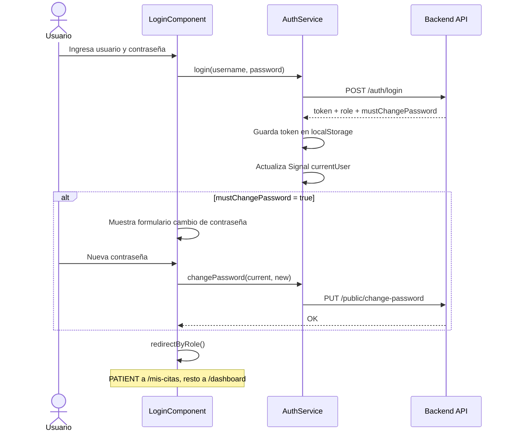
```mermaid
sequenceDiagram
    actor Usuario
    participant Login as LoginComponent
    participant AuthSvc as AuthService
    participant API as Backend API

    Usuario->>Login: Ingresa usuario y contraseña
    Login->>AuthSvc: login(username, password)
    AuthSvc->>API: POST /auth/login
    API-->>AuthSvc: token + role + mustChangePassword

    AuthSvc->>AuthSvc: Guarda token en localStorage
    AuthSvc->>AuthSvc: Actualiza Signal currentUser

    alt mustChangePassword = true
        Login->>Login: Muestra formulario cambio de contraseña
        Usuario->>Login: Nueva contraseña
        Login->>AuthSvc: changePassword(current, new)
        AuthSvc->>API: PUT /public/change-password
        API-->>Login: OK
    end

    Login->>Login: redirectByRole()
    note over Login: PATIENT a /mis-citas, resto a /dashboard
```

### 6.2 Registro Walk-in de Paciente

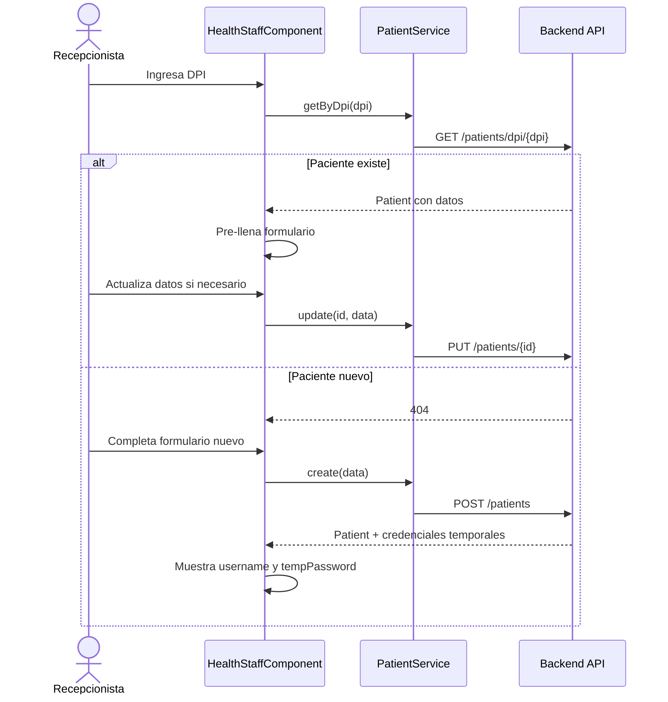
```mermaid
sequenceDiagram
    actor Recep as Recepcionista
    participant HS as HealthStaffComponent
    participant PatSvc as PatientService
    participant API as Backend API

    Recep->>HS: Ingresa DPI
    HS->>PatSvc: getByDpi(dpi)
    PatSvc->>API: GET /patients/dpi/{dpi}

    alt Paciente existe
        API-->>HS: Patient con datos
        HS->>HS: Pre-llena formulario
        Recep->>HS: Actualiza datos si necesario
        HS->>PatSvc: update(id, data)
        PatSvc->>API: PUT /patients/{id}
    else Paciente nuevo
        API-->>HS: 404
        Recep->>HS: Completa formulario nuevo
        HS->>PatSvc: create(data)
        PatSvc->>API: POST /patients
        API-->>HS: Patient + credenciales temporales
        HS->>HS: Muestra username y tempPassword
    end
```

### 6.3 Flujo de Cola de Atención (CU-03)

> **Nota:** El ticket **no es creado por enfermería**. Se origina automáticamente al agendar y pagar la cita en Caja (ver secuencia 6.6). Esto es consistente con la relación `APPOINTMENTS ||--o| TICKETS : "origina"` en el ER. La enfermería retoma el flujo una vez el ticket ya existe en estado `WAITING`.

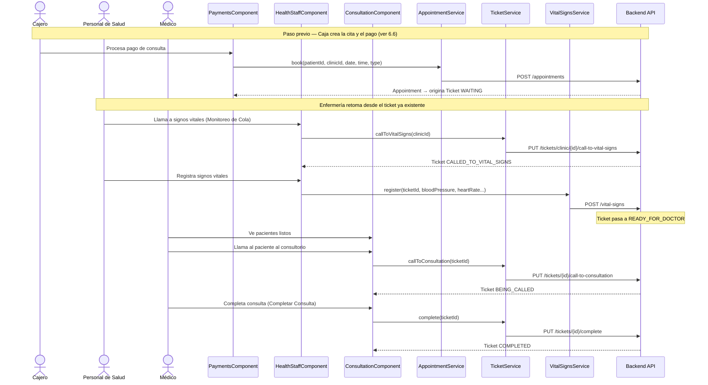
```mermaid
sequenceDiagram
    actor Cashier as Cajero
    actor Nurse as Personal de Salud
    actor Doctor as Médico
    participant PayComp as PaymentsComponent
    participant HS as HealthStaffComponent
    participant Consult as ConsultationComponent
    participant ApptSvc as AppointmentService
    participant TickSvc as TicketService
    participant VitalSvc as VitalSignsService
    participant API as Backend API

    note over Cashier,API: Paso previo — Caja crea la cita y el pago (ver 6.6)
    Cashier->>PayComp: Procesa pago de consulta
    PayComp->>ApptSvc: book(patientId, clinicId, date, time, type)
    ApptSvc->>API: POST /appointments
    API-->>PayComp: Appointment → origina Ticket WAITING

    note over Nurse,API: Enfermería retoma desde el ticket ya existente
    Nurse->>HS: Llama a signos vitales (Monitoreo de Cola)
    HS->>TickSvc: callToVitalSigns(clinicId)
    TickSvc->>API: PUT /tickets/clinic/{id}/call-to-vital-signs
    API-->>HS: Ticket CALLED_TO_VITAL_SIGNS

    Nurse->>HS: Registra signos vitales
    HS->>VitalSvc: register(ticketId, bloodPressure, heartRate...)
    VitalSvc->>API: POST /vital-signs
    note over API: Ticket pasa a READY_FOR_DOCTOR

    Doctor->>Consult: Ve pacientes listos
    Doctor->>Consult: Llama al paciente al consultorio
    Consult->>TickSvc: callToConsultation(ticketId)
    TickSvc->>API: PUT /tickets/{id}/call-to-consultation
    API-->>Consult: Ticket BEING_CALLED

    Doctor->>Consult: Completa consulta (Completar Consulta)
    Consult->>TickSvc: complete(ticketId)
    TickSvc->>API: PUT /tickets/{id}/complete
    API-->>Consult: Ticket COMPLETED
```

### 6.4 Flujo de Laboratorio

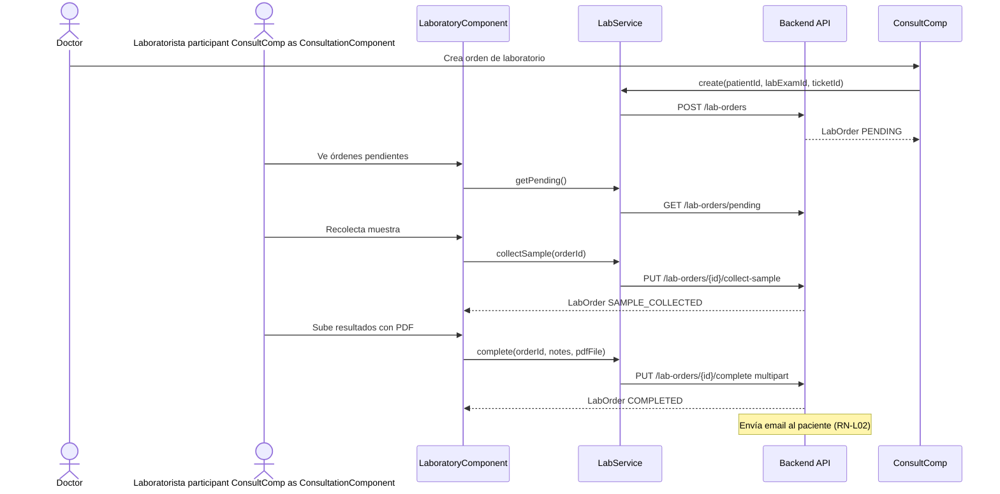
```mermaid
sequenceDiagram
    actor Doc as Doctor
    actor Lab as Laboratorista    participant ConsultComp as ConsultationComponent
    participant LabComp as LaboratoryComponent
    participant LabSvc as LabService
    participant API as Backend API

    Doc->>ConsultComp: Crea orden de laboratorio
    ConsultComp->>LabSvc: create(patientId, labExamId, ticketId)
    LabSvc->>API: POST /lab-orders
    API-->>ConsultComp: LabOrder PENDING

    Lab->>LabComp: Ve órdenes pendientes
    LabComp->>LabSvc: getPending()
    LabSvc->>API: GET /lab-orders/pending

    Lab->>LabComp: Recolecta muestra
    LabComp->>LabSvc: collectSample(orderId)
    LabSvc->>API: PUT /lab-orders/{id}/collect-sample
    API-->>LabComp: LabOrder SAMPLE_COLLECTED

    Lab->>LabComp: Sube resultados con PDF
    LabComp->>LabSvc: complete(orderId, notes, pdfFile)
    LabSvc->>API: PUT /lab-orders/{id}/complete multipart
    API-->>LabComp: LabOrder COMPLETED
    note over API: Envía email al paciente (RN-L02)
```

### 6.5 Flujo de Farmacia

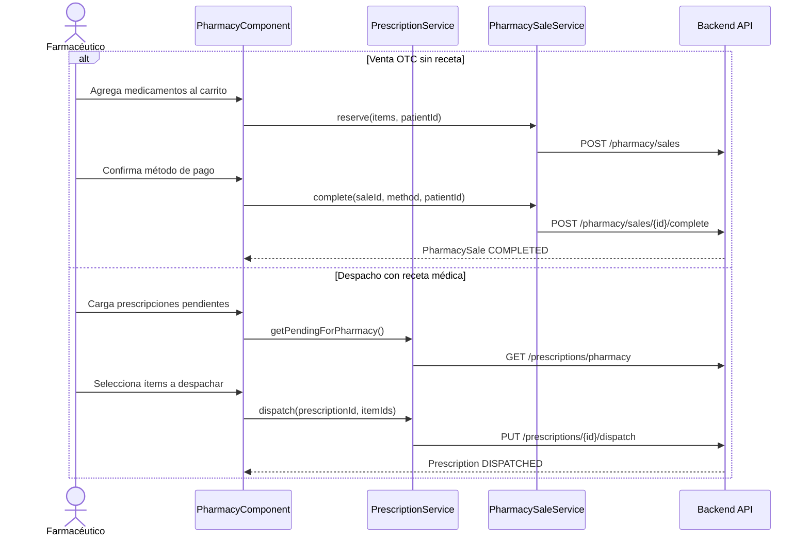
```mermaid
sequenceDiagram
    actor Pharm as Farmacéutico
    participant PharmComp as PharmacyComponent
    participant PrescSvc as PrescriptionService
    participant SaleSvc as PharmacySaleService
    participant API as Backend API

    alt Venta OTC sin receta
        Pharm->>PharmComp: Agrega medicamentos al carrito
        PharmComp->>SaleSvc: reserve(items, patientId)
        SaleSvc->>API: POST /pharmacy/sales
        Pharm->>PharmComp: Confirma método de pago
        PharmComp->>SaleSvc: complete(saleId, method, patientId)
        SaleSvc->>API: POST /pharmacy/sales/{id}/complete
        API-->>PharmComp: PharmacySale COMPLETED
    else Despacho con receta médica
        Pharm->>PharmComp: Carga prescripciones pendientes
        PharmComp->>PrescSvc: getPendingForPharmacy()
        PrescSvc->>API: GET /prescriptions/pharmacy
        Pharm->>PharmComp: Selecciona ítems a despachar
        PharmComp->>PrescSvc: dispatch(prescriptionId, itemIds)
        PrescSvc->>API: PUT /prescriptions/{id}/dispatch
        API-->>PharmComp: Prescription DISPATCHED
    end
```

### 6.6 Flujo de Pago en Caja

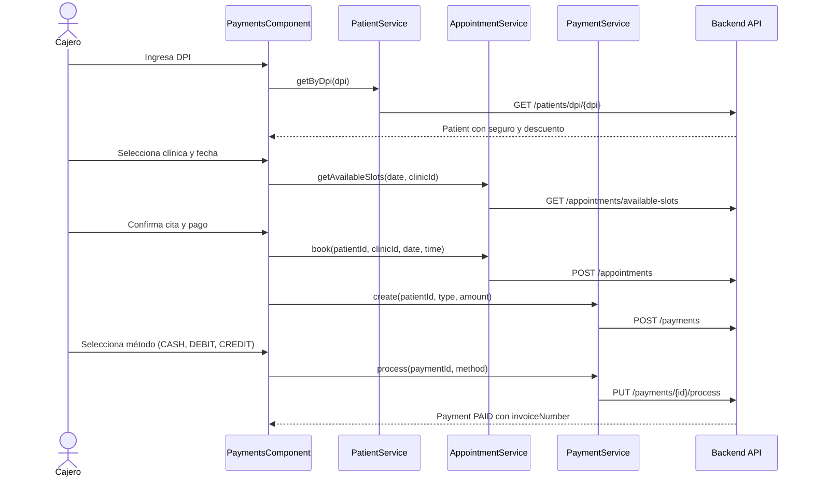
```mermaid
sequenceDiagram
    actor Cajero
    participant PayComp as PaymentsComponent
    participant PatSvc as PatientService
    participant ApptSvc as AppointmentService
    participant PaySvc as PaymentService
    participant API as Backend API

    Cajero->>PayComp: Ingresa DPI
    PayComp->>PatSvc: getByDpi(dpi)
    PatSvc->>API: GET /patients/dpi/{dpi}
    API-->>PayComp: Patient con seguro y descuento

    Cajero->>PayComp: Selecciona clínica y fecha
    PayComp->>ApptSvc: getAvailableSlots(date, clinicId)
    ApptSvc->>API: GET /appointments/available-slots

    Cajero->>PayComp: Confirma cita y pago
    PayComp->>ApptSvc: book(patientId, clinicId, date, time)
    ApptSvc->>API: POST /appointments

    PayComp->>PaySvc: create(patientId, type, amount)
    PaySvc->>API: POST /payments

    Cajero->>PayComp: Selecciona método (CASH, DEBIT, CREDIT)
    PayComp->>PaySvc: process(paymentId, method)
    PaySvc->>API: PUT /payments/{id}/process
    API-->>PayComp: Payment PAID con invoiceNumber
```

### 6.7 Flujo de Emergencia

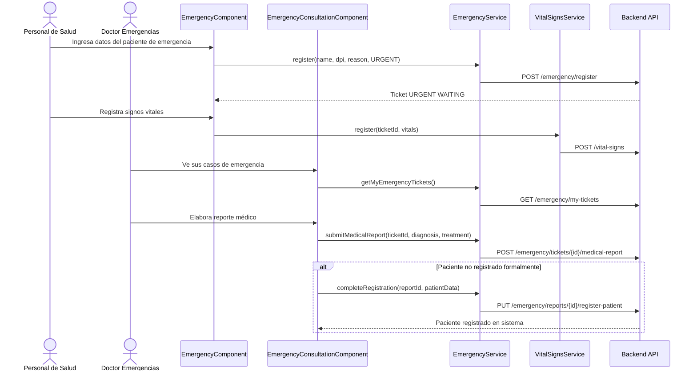
```mermaid
sequenceDiagram
    actor Recep as Personal de Salud
    actor Doc as Doctor Emergencias
    participant EmgComp as EmergencyComponent
    participant EmgConsult as EmergencyConsultationComponent
    participant EmgSvc as EmergencyService
    participant VitalSvc as VitalSignsService
    participant API as Backend API

    Recep->>EmgComp: Ingresa datos del paciente de emergencia
    EmgComp->>EmgSvc: register(name, dpi, reason, URGENT)
    EmgSvc->>API: POST /emergency/register
    API-->>EmgComp: Ticket URGENT WAITING

    Recep->>EmgComp: Registra signos vitales
    EmgComp->>VitalSvc: register(ticketId, vitals)
    VitalSvc->>API: POST /vital-signs

    Doc->>EmgConsult: Ve sus casos de emergencia
    EmgConsult->>EmgSvc: getMyEmergencyTickets()
    EmgSvc->>API: GET /emergency/my-tickets

    Doc->>EmgConsult: Elabora reporte médico
    EmgConsult->>EmgSvc: submitMedicalReport(ticketId, diagnosis, treatment)
    EmgSvc->>API: POST /emergency/tickets/{id}/medical-report

    alt Paciente no registrado formalmente
        EmgConsult->>EmgSvc: completeRegistration(reportId, patientData)
        EmgSvc->>API: PUT /emergency/reports/{id}/register-patient
        API-->>EmgConsult: Paciente registrado en sistema
    end
```

### 6.8 Dashboard en Tiempo Real (RN-R03)

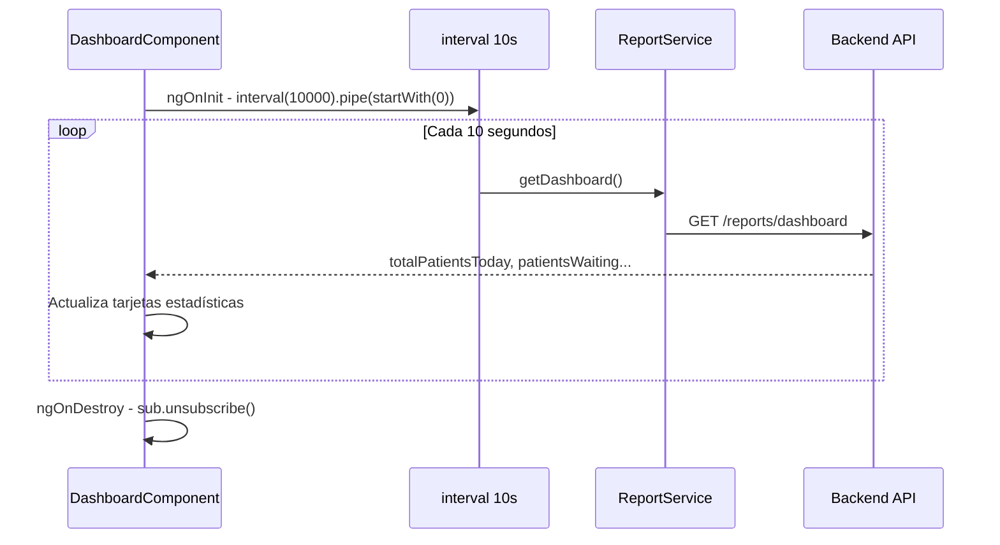
```mermaid
sequenceDiagram
    participant Dashboard as DashboardComponent
    participant RxJS as interval 10s
    participant ReportSvc as ReportService
    participant API as Backend API

    Dashboard->>RxJS: ngOnInit - interval(10000).pipe(startWith(0))

    loop Cada 10 segundos
        RxJS->>ReportSvc: getDashboard()
        ReportSvc->>API: GET /reports/dashboard
        API-->>Dashboard: totalPatientsToday, patientsWaiting...
        Dashboard->>Dashboard: Actualiza tarjetas estadísticas
    end

    Dashboard->>Dashboard: ngOnDestroy - sub.unsubscribe()
```

---

## 7. Base de Datos

### 7.1 Configuración

| Parámetro | Valor |
|-----------|-------|
| Motor | PostgreSQL |
| Host | Neon Cloud (serverless) |
| Región | US East 2 (AWS) |
| DDL auto | `update` (Hibernate gestiona el esquema) |
| SSL | Requerido |
| Pool | Habilitado (pgBouncer via Neon) |

### 7.2 Diagrama Entidad-Relación — Dominio Principal

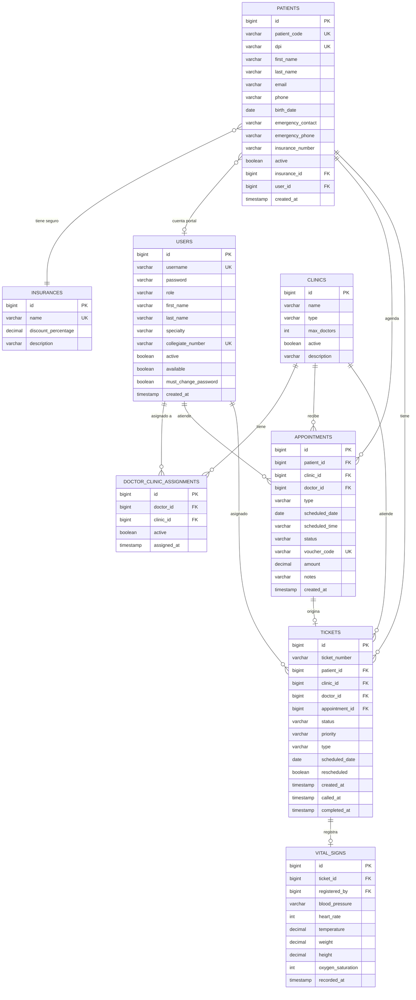
```mermaid
erDiagram
    USERS {
        bigint id PK
        varchar username UK
        varchar password
        varchar role
        varchar first_name
        varchar last_name
        varchar specialty
        varchar collegiate_number UK
        boolean active
        boolean available
        boolean must_change_password
        timestamp created_at
    }

    INSURANCES {
        bigint id PK
        varchar name UK
        decimal discount_percentage
        varchar description
    }

    PATIENTS {
        bigint id PK
        varchar patient_code UK
        varchar dpi UK
        varchar first_name
        varchar last_name
        varchar email
        varchar phone
        date birth_date
        varchar emergency_contact
        varchar emergency_phone
        varchar insurance_number
        boolean active
        bigint insurance_id FK
        bigint user_id FK
        timestamp created_at
    }

    CLINICS {
        bigint id PK
        varchar name
        varchar type
        int max_doctors
        boolean active
        varchar description
    }

    DOCTOR_CLINIC_ASSIGNMENTS {
        bigint id PK
        bigint doctor_id FK
        bigint clinic_id FK
        boolean active
        timestamp assigned_at
    }

    APPOINTMENTS {
        bigint id PK
        bigint patient_id FK
        bigint clinic_id FK
        bigint doctor_id FK
        varchar type
        date scheduled_date
        varchar scheduled_time
        varchar status
        varchar voucher_code UK
        decimal amount
        varchar notes
        timestamp created_at
    }

    TICKETS {
        bigint id PK
        varchar ticket_number
        bigint patient_id FK
        bigint clinic_id FK
        bigint doctor_id FK
        bigint appointment_id FK
        varchar status
        varchar priority
        varchar type
        date scheduled_date
        boolean rescheduled
        timestamp created_at
        timestamp called_at
        timestamp completed_at
    }

    VITAL_SIGNS {
        bigint id PK
        bigint ticket_id FK
        bigint registered_by FK
        varchar blood_pressure
        int heart_rate
        decimal temperature
        decimal weight
        decimal height
        int oxygen_saturation
        timestamp recorded_at
    }

    USERS ||--o{ DOCTOR_CLINIC_ASSIGNMENTS : "asignado a"
    CLINICS ||--o{ DOCTOR_CLINIC_ASSIGNMENTS : "tiene"
    PATIENTS }o--|| INSURANCES : "tiene seguro"
    PATIENTS }o--o| USERS : "cuenta portal"
    PATIENTS ||--o{ APPOINTMENTS : "agenda"
    PATIENTS ||--o{ TICKETS : "tiene"
    CLINICS ||--o{ APPOINTMENTS : "recibe"
    CLINICS ||--o{ TICKETS : "atiende"
    USERS ||--o{ APPOINTMENTS : "atiende"
    USERS ||--o{ TICKETS : "asignado"
    APPOINTMENTS ||--o| TICKETS : "origina"
    TICKETS ||--o| VITAL_SIGNS : "registra"
```

### 7.3 Diagrama ER — Módulo Clínico

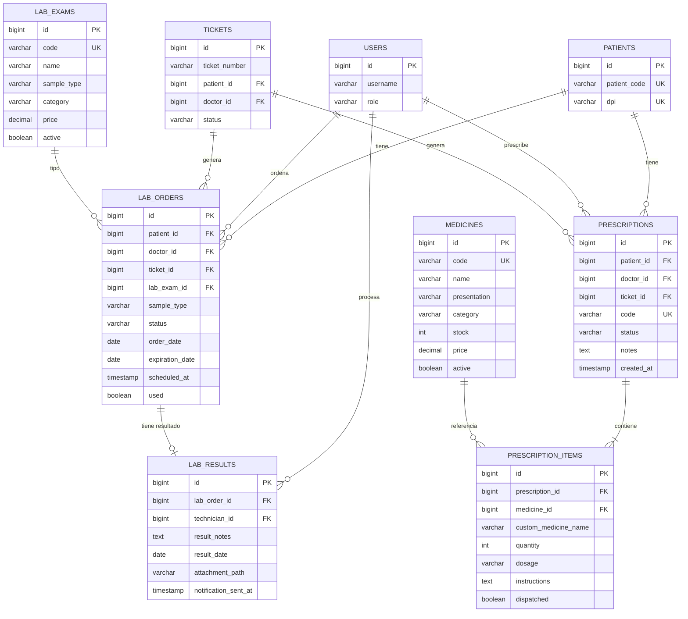
```mermaid
erDiagram
    TICKETS {
        bigint id PK
        varchar ticket_number
        bigint patient_id FK
        bigint doctor_id FK
        varchar status
    }

    PATIENTS {
        bigint id PK
        varchar patient_code UK
        varchar dpi UK
    }

    USERS {
        bigint id PK
        varchar username
        varchar role
    }

    LAB_EXAMS {
        bigint id PK
        varchar code UK
        varchar name
        varchar sample_type
        varchar category
        decimal price
        boolean active
    }

    LAB_ORDERS {
        bigint id PK
        bigint patient_id FK
        bigint doctor_id FK
        bigint ticket_id FK
        bigint lab_exam_id FK
        varchar sample_type
        varchar status
        date order_date
        date expiration_date
        timestamp scheduled_at
        boolean used
    }

    LAB_RESULTS {
        bigint id PK
        bigint lab_order_id FK
        bigint technician_id FK
        text result_notes
        date result_date
        varchar attachment_path
        timestamp notification_sent_at
    }

    PRESCRIPTIONS {
        bigint id PK
        bigint patient_id FK
        bigint doctor_id FK
        bigint ticket_id FK
        varchar code UK
        varchar status
        text notes
        timestamp created_at
    }

    PRESCRIPTION_ITEMS {
        bigint id PK
        bigint prescription_id FK
        bigint medicine_id FK
        varchar custom_medicine_name
        int quantity
        varchar dosage
        text instructions
        boolean dispatched
    }

    MEDICINES {
        bigint id PK
        varchar code UK
        varchar name
        varchar presentation
        varchar category
        int stock
        decimal price
        boolean active
    }

    PATIENTS ||--o{ LAB_ORDERS : "tiene"
    PATIENTS ||--o{ PRESCRIPTIONS : "tiene"
    USERS ||--o{ LAB_ORDERS : "ordena"
    USERS ||--o{ PRESCRIPTIONS : "prescribe"
    USERS ||--o{ LAB_RESULTS : "procesa"
    TICKETS ||--o{ LAB_ORDERS : "genera"
    TICKETS ||--o{ PRESCRIPTIONS : "genera"
    LAB_EXAMS ||--o{ LAB_ORDERS : "tipo"
    LAB_ORDERS ||--o| LAB_RESULTS : "tiene resultado"
    PRESCRIPTIONS ||--|{ PRESCRIPTION_ITEMS : "contiene"
    MEDICINES ||--o{ PRESCRIPTION_ITEMS : "referencia"
```

### 7.4 Diagrama ER — Módulo Financiero y Farmacia

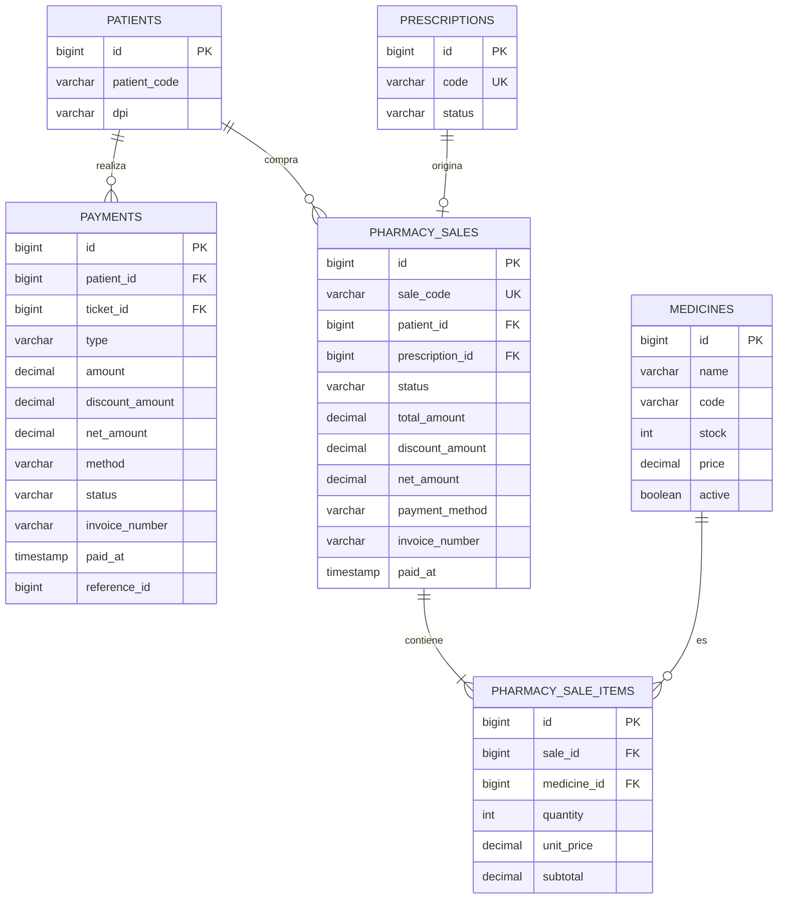
```mermaid
erDiagram
    PATIENTS {
        bigint id PK
        varchar patient_code
        varchar dpi
    }

    PAYMENTS {
        bigint id PK
        bigint patient_id FK
        bigint ticket_id FK
        varchar type
        decimal amount
        decimal discount_amount
        decimal net_amount
        varchar method
        varchar status
        varchar invoice_number
        timestamp paid_at
        bigint reference_id
    }

    PHARMACY_SALES {
        bigint id PK
        varchar sale_code UK
        bigint patient_id FK
        bigint prescription_id FK
        varchar status
        decimal total_amount
        decimal discount_amount
        decimal net_amount
        varchar payment_method
        varchar invoice_number
        timestamp paid_at
    }

    PHARMACY_SALE_ITEMS {
        bigint id PK
        bigint sale_id FK
        bigint medicine_id FK
        int quantity
        decimal unit_price
        decimal subtotal
    }

    MEDICINES {
        bigint id PK
        varchar name
        varchar code
        int stock
        decimal price
        boolean active
    }

    PRESCRIPTIONS {
        bigint id PK
        varchar code UK
        varchar status
    }

    PATIENTS ||--o{ PAYMENTS : "realiza"
    PATIENTS ||--o{ PHARMACY_SALES : "compra"
    PRESCRIPTIONS ||--o| PHARMACY_SALES : "origina"
    PHARMACY_SALES ||--|{ PHARMACY_SALE_ITEMS : "contiene"
    MEDICINES ||--o{ PHARMACY_SALE_ITEMS : "es"
```

### 7.5 Inventario de Tablas

| # | Tabla | Registros iniciales | Propósito |
|---|-------|---------------------|-----------|
| 1 | `users` | Seeded (admin + staff) | Personal médico y administrativo |
| 2 | `patients` | — | Expedientes de pacientes |
| 3 | `insurances` | 3 (EL_ROBLE, UNIVERSALES, GT) | Planes de seguro médico |
| 4 | `clinics` | Seeded | Clínicas del hospital |
| 5 | `doctor_clinic_assignments` | — | Doctor asignado a clínica |
| 6 | `doctor_schedules` | — | Horarios de médicos |
| 7 | `clinic_schedules` | — | Horarios de clínicas |
| 8 | `appointments` | — | Citas programadas |
| 9 | `slot_reservations` | — | Reservas temporales de slots |
| 10 | `tickets` | — | Turnos de la cola de atención |
| 11 | `vital_signs` | — | Signos vitales por turno |
| 12 | `prescriptions` | — | Recetas médicas |
| 13 | `prescription_items` | — | Ítems de receta |
| 14 | `medicines` | ~45 (FAR-001…FAR-045) | Catálogo de medicamentos |
| 15 | `lab_exams` | ~40 (LAB-001…LAB-040) | Catálogo de exámenes de laboratorio |
| 16 | `lab_orders` | — | Órdenes de laboratorio |
| 17 | `lab_results` | — | Resultados de laboratorio (+ PDF) |
| 18 | `payments` | — | Pagos procesados |
| 19 | `pharmacy_sales` | — | Ventas de farmacia |
| 20 | `pharmacy_sale_items` | — | Ítems de ventas de farmacia |
| 21 | `documents` | — | Documentos adjuntos (PDF) |
| 22 | `emergency_reports` | — | Reportes iniciales de emergencia |
| 23 | `emergency_medical_reports` | — | Reportes médicos de emergencia |

---

## 8. Diagrama de Despliegue

### 8.1 Arquitectura de producción

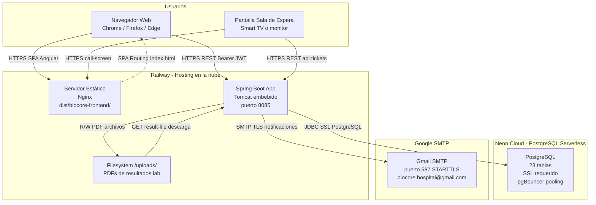
```mermaid
flowchart TB
    subgraph Usuarios["Usuarios"]
        Browser["Navegador Web\nChrome / Firefox / Edge"]
        TV["Pantalla Sala de Espera\nSmart TV o monitor"]
    end

    subgraph Railway["Railway - Hosting en la nube"]
        WebServer["Servidor Estático\nNginx\ndist/biocore-frontend/"]
        SpringBoot["Spring Boot App\nTomcat embebido\npuerto 8085"]
        Uploads["Filesystem /uploads/\nPDFs de resultados lab"]
    end

    subgraph NeonCloud["Neon Cloud - PostgreSQL Serverless"]
        DB["PostgreSQL\n23 tablas\nSSL requerido\npgBouncer pooling"]
    end

    subgraph Gmail["Google SMTP"]
        SMTP["Gmail SMTP\npuerto 587 STARTTLS\nbiocore.hospital@gmail.com"]
    end

    Browser -->|HTTPS SPA Angular| WebServer
    TV -->|HTTPS call-screen| WebServer
    Browser -->|HTTPS REST Bearer JWT| SpringBoot
    TV -->|HTTPS REST api tickets| SpringBoot
    SpringBoot -->|JDBC SSL PostgreSQL| DB
    SpringBoot -->|R/W PDF archivos| Uploads
    Uploads -->|GET result-file descarga| SpringBoot
    WebServer -.->|SPA Routing index.html| Browser
    SpringBoot -->|SMTP TLS notificaciones| SMTP
```

### 8.2 Descripción de nodos

| Nodo | Tecnología | Puerto | Responsabilidad |
|------|-----------|--------|-----------------|
| Navegador web | Chrome / Firefox / Edge | — | Ejecuta SPA Angular |
| Pantalla sala espera | Smart TV / monitor | — | Vista `/call-screen` (turnos) |
| Servidor estático | Nginx en Railway | 443 HTTPS | Sirve archivos compilados Angular |
| Spring Boot App | Java 17 + Tomcat | 8085 (Railway mapea 443) | API REST, lógica de negocio, JWT |
| PostgreSQL | Neon Cloud | 5432 SSL | Persistencia relacional de datos |
| Filesystem | Railway ephemeral | — | PDFs resultados de laboratorio |
| Gmail SMTP | Google | 587 | Notificaciones a pacientes (RN-L02) |

### 8.3 Flujo de build y despliegue

```
Desarrollador
    │
    ├── Frontend
    │   ├── npm run build (ng build --configuration production)
    │   ├── Genera dist/biocore-frontend/
    │   └── Git push → Railway auto-deploy
    │
    └── Backend
        ├── mvn clean package (genera biocore-backend.jar)
        ├── Git push → Railway auto-deploy
        └── Variables de entorno configuradas en Railway dashboard
```

### 8.4 Variables de entorno requeridas

#### Backend (Railway Environment Variables)
```properties
PORT=8085
SPRING_DATASOURCE_URL=jdbc:postgresql://<neon-host>/neondb?sslmode=require
SPRING_DATASOURCE_USERNAME=<usuario>
SPRING_DATASOURCE_PASSWORD=<contraseña>
APP_JWT_SECRET=<clave-secreta-256-bits>
APP_JWT_EXPIRATION=86400000
APP_CORS_ALLOWED_ORIGINS=https://<frontend-domain>
SPRING_MAIL_USERNAME=<gmail>
SPRING_MAIL_PASSWORD=<app-password>
APP_UPLOAD_DIR=uploads/
```

#### Frontend (environment.prod.ts)
```typescript
export const environment = {
  production: true,
  apiUrl: 'https://<backend-railway-domain>/api'
};
```

---

*Manual Técnico BioCore Medical — v2.2 — 2026-05-17*
