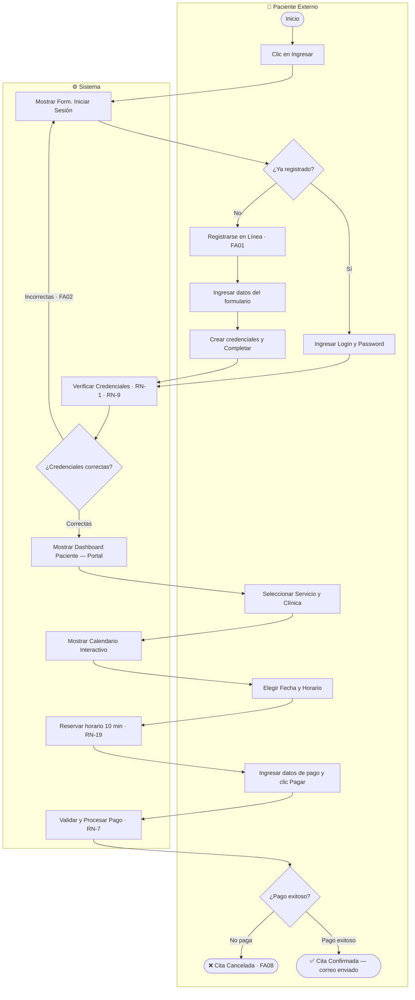
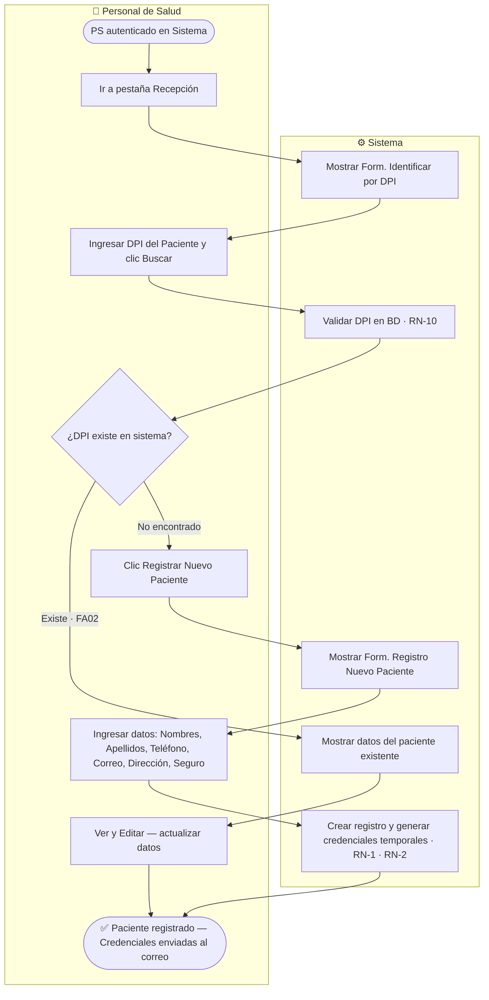
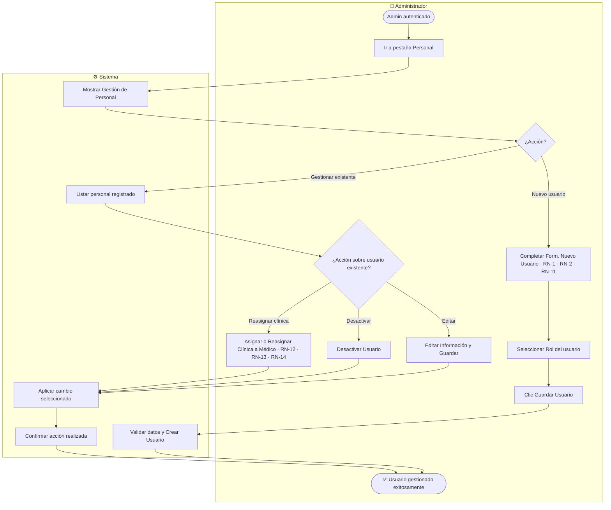
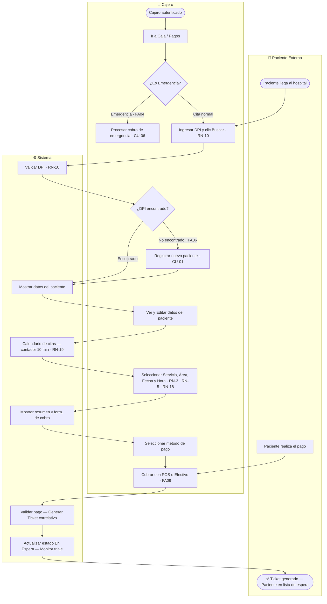
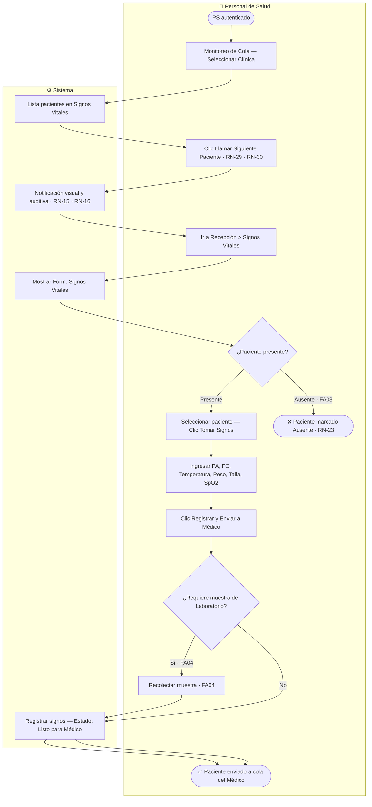
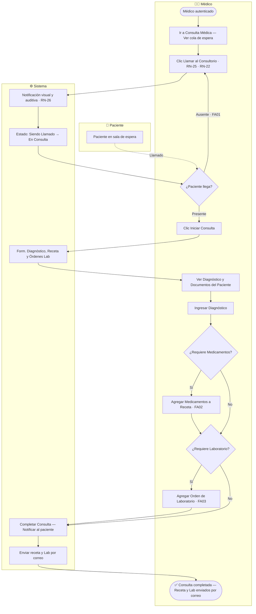
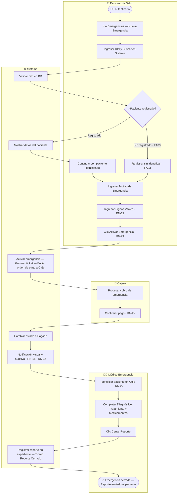
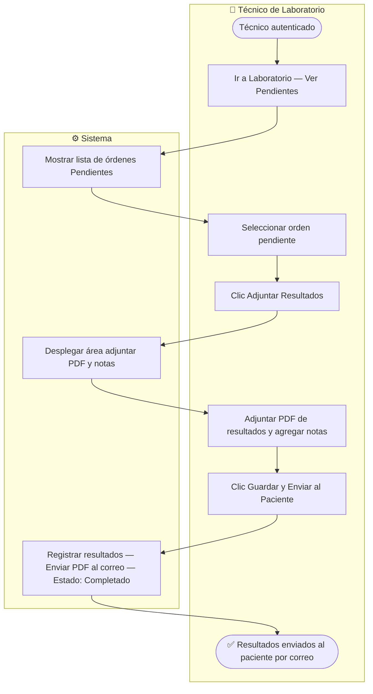
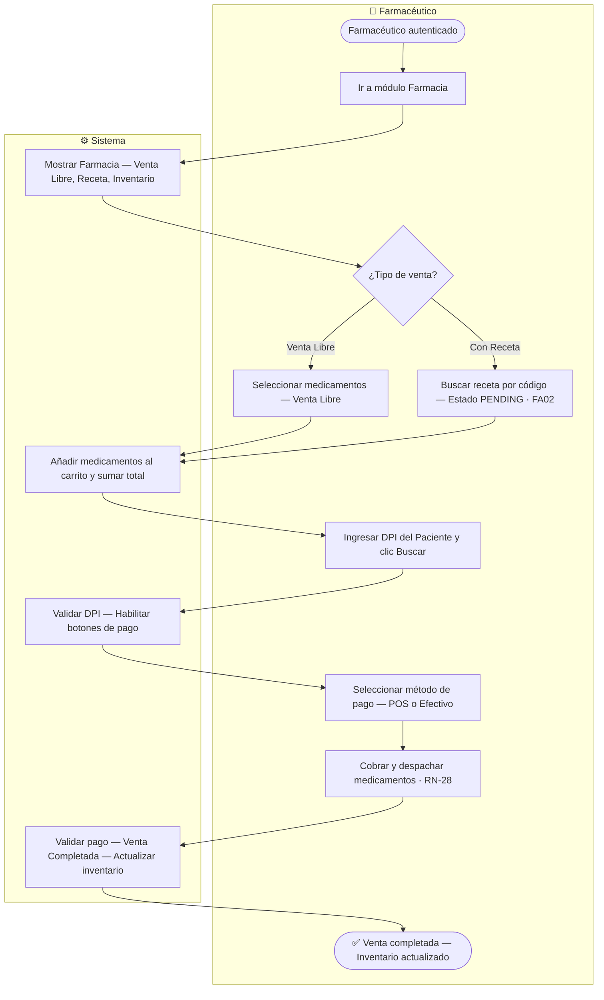
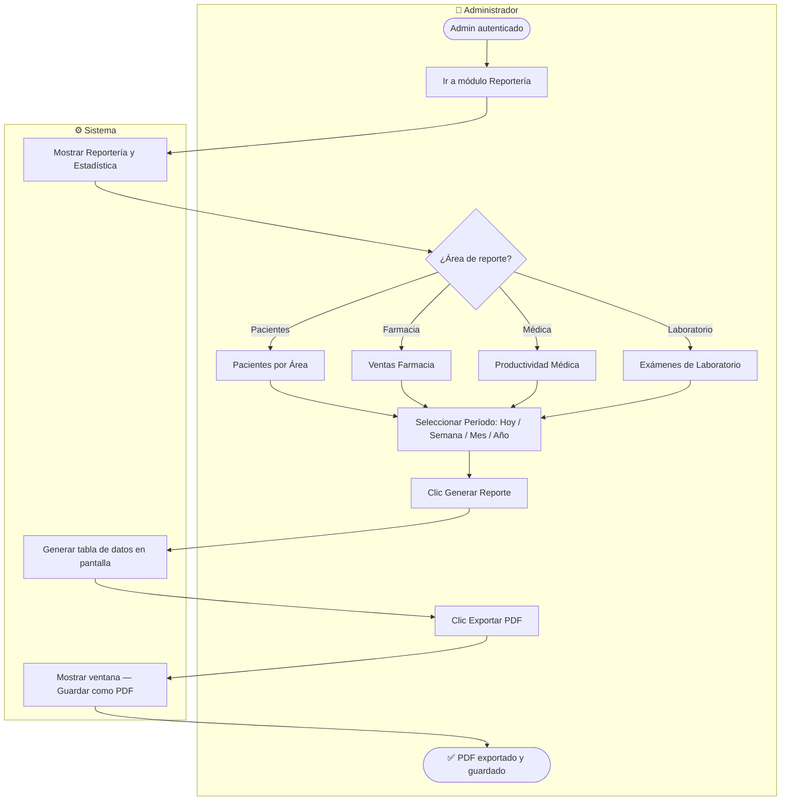

# BioCore Medical — Diagramas de Procesos por Caso de Uso

Cada diagrama muestra el flujo de acciones por **rol** que ejecuta el proceso.
Los subgrafos representan los actores. Las flechas indican la secuencia de pasos.

---

## CU 00 — Portal Web

**Roles:** Paciente Externo · Sistema

---

## CU 01 — Registro de Pacientes

**Roles:** Personal de Salud · Sistema

---

## CU 02 — Mantenimiento de Usuario

**Roles:** Administrador · Sistema

---

## CU 03 — Gestión de Citas y Pagos

**Roles:** Cajero · Paciente Externo · Sistema

---

## CU 04 — Toma de Signos Vitales

**Roles:** Personal de Salud · Sistema

---

## CU 05 — Consulta Médica

**Roles:** Médico · Paciente · Sistema

---

## CU 06 — Atención de Emergencia

**Roles:** Personal de Salud · Cajero · Médico de Emergencia · Sistema

---

## CU 07 — Laboratorio

**Roles:** Técnico de Laboratorio · Sistema

---

## CU 08 — Farmacia

**Roles:** Farmacéutico · Sistema

---

## CU 09 — Reportería

**Roles:** Administrador · Sistema

---

## Resumen de Roles por CU

| CU | Nombre | Roles involucrados |
|---|---|---|
| CU 00 | Portal Web | Paciente Externo, Sistema |
| CU 01 | Registro de Pacientes | Personal de Salud, Sistema |
| CU 02 | Mantenimiento de Usuarios | Administrador, Sistema |
| CU 03 | Gestión de Citas y Pagos | Cajero, Paciente Externo, Sistema |
| CU 04 | Toma de Signos Vitales | Personal de Salud (HEALTH_STAFF / NURSE), Sistema |
| CU 05 | Consulta Médica | Médico (DOCTOR), Paciente, Sistema |
| CU 06 | Atención de Emergencia | Personal de Salud, Cajero, Médico Emergencia, Sistema |
| CU 07 | Laboratorio | Técnico de Laboratorio (LAB_TECHNICIAN), Sistema |
| CU 08 | Farmacia | Farmacéutico (PHARMACIST), Sistema |
| CU 09 | Reportería | Administrador (ADMIN), Sistema |
