# BioCore Medical — Diagrama de Flujo Consolidado

Swimlanes horizontales por rol · cada fila = un rol · flujo L → R dentro de cada fila · centrado en la cita médica.

```mermaid
flowchart TB

  %% ════════════════════════════════════════════════════════
  subgraph swimPAC["👤  PACIENTE"]
    direction LR
    pStart(["Inicio"]) --> pPortal["Accede al\nportal web"]
    pPortal --> pCuenta{"¿Tiene\ncuenta?"}
    pCuenta -->|No| pReg["Crea cuenta\n· RN-1 · RN-2\nUsuario único · RN-U01"]
    pCuenta -->|Sí| pSel["Selecciona servicio\nclínica y horario\nFiltro ≥ 30 min · RN-19"]
    pReg --> pSel
    pSel --> pPago{"💳 Procesar\npago · RN-7\n16 dígitos tarjeta"}
    pPago -->|Falla| pFail(["❌ Cita\ncancelada"])
    pRscd["Reagendar desde\nportal · filtro ≥ 30 min"]
  end

  %% ════════════════════════════════════════════════════════
  subgraph swimRECEP["🏥  RECEPCIÓN / HEALTH STAFF"]
    direction LR
    rDpi["Busca paciente\npor DPI"] --> rExiste{"¿DPI\nencontrado?"}
    rExiste -->|No| rNuevo["Registra paciente\nPAT-XXXX · RN-4"]
    rExiste -->|Sí| rActualiza["Ver / actualizar\ndatos"]
    rNuevo --> rListo["✓ Paciente\nlisto"]
    rActualiza --> rListo

    svLlama["Llama a Signos\nVitales · RN-29\n→ CALLED_TO_VITAL_SIGNS"] --> svPresente{"¿Paciente\npresente?"}
    svPresente -->|Ausente| svAusencia{"¿1ra\nausencia?"}
    svAusencia -->|Sí| svPend(["⏳ ABSENT_PENDING\nRESCHEDULE"])
    svAusencia -->|2da| svAus(["❌ ABSENT"])
    svPresente -->|Presente| svReg["Registra signos vitales\nPA · FC · Temp · Peso · Talla · SpO2\nTodos campos obligatorios · RN-29\n→ READY_FOR_DOCTOR"]
    svReg --> svMuestra{"¿Muestra\nde lab?"}
    svMuestra -->|Sí| svRecolecta["Recolecta muestra\n· FA04"]
    svMuestra -->|No| svOk["✓ Listo\npara médico"]
  end

  %% ════════════════════════════════════════════════════════
  subgraph swimCAJ["💼  CAJERO"]
    direction LR
    cSel["Busca paciente · DPI\nSelecciona servicio\ny horario"] --> cEmerg{"¿Es\nEmergencia?"}
    cEmerg -->|No| cCobro["Cobra: POS o Efectivo\n· RN-3 · RN-5\nDescuento seguro si aplica"]
    cEmerg -->|Sí| cEmerCobro["Cobra emergencia\n· RN-27"]
    cCobro --> cTicket["Ticket correlativo\ngenerado"]
    cTicket --> cRecibo["Recibo muestra\nmonto neto con descuento"]
    cLabCobro["Cobra orden\nde laboratorio"] --> cReciboLab["Recibo muestra\nmonto neto con descuento"]
    cRscd["Reagendar cita\nfiltro ≥ 30 min · RN-19"]
  end

  %% ════════════════════════════════════════════════════════
  subgraph swimSIS["⚙️  SISTEMA  —  acciones automáticas"]
    direction LR
    sisGen["Genera Ticket\n→ WAITING\nCorreo confirmación"] --> sisCola["Cola de espera\n→ WAITING"]
    sisGen2["Genera Ticket\n→ WAITING\nAsigna médico · RN-18"] --> sisCola
    sisCorreo["📧 Correo resumen\nde consulta enviado"]
    sisCorreoLab["📧 Correo resultado\nlab · RN-L02 · RN-L03"]
  end

  %% ════════════════════════════════════════════════════════
  subgraph swimMED["👨‍⚕️  MÉDICO"]
    direction LR
    mLlama["Llama paciente\nal consultorio\n→ BEING_CALLED · RN-25"] --> mPresente{"¿Llega?"}
    mPresente -->|"Ausente · FA01"| mLlama
    mPresente -->|Presente| mConsulta["Inicia consulta\n→ IN_CONSULTATION"]
    mConsulta --> mHistorial["Revisa historial\ny diagnósticos previos"]
    mHistorial --> mDiag["Ingresa\ndiagnóstico"]
    mDiag --> mReceta{"¿Receta?"}
    mReceta -->|Sí| mEmiteR["Emite receta\ncon dosis · FA02"]
    mReceta -->|No| mLab
    mEmiteR --> mLab{"¿Orden\nlab?"}
    mLab -->|Sí| mEmiteLab["Emite orden lab\n30 días · FA03 · RN-L01"]
    mLab -->|No| mCompleta["Completa consulta\n→ COMPLETED"]
    mEmiteLab --> mCompleta

    mEmer["Atiende\nemergencia"] --> mEmerDiag["Diagnóstico y\ntratamiento"] --> mEmerCierre["Cierra reporte\nCorreo al paciente"]
  end

  %% ════════════════════════════════════════════════════════
  subgraph swimLAB["🔬  LABORATORIO  (Lab Technician + Cajero)"]
    direction LR
    labCobro["Cajero cobra\nordenlab"] --> labTec["Técnico procesa\nmuestra → IN_PROGRESS"]
    labTec --> labResultado["Adjunta PDF\nresultados → COMPLETED"]
    labResultado --> labNotifica["Notifica al\npaciente · RN-L03"]
  end

  %% ════════════════════════════════════════════════════════
  subgraph swimFAR["💊  FARMACIA  (Farmacéutico + Cajero)"]
    direction LR
    farTipo{"¿Tipo de\nventa?"} -->|Con receta| farReceta["Busca receta\npor código · RN-F01"]
    farTipo -->|Venta libre| farOTC["Agrega OTC\nal carrito"]
    farReceta --> farDpi["Ingresa DPI\npara seguro"]
    farOTC --> farDpi
    farDpi --> farCobro["Cobra: POS o Efectivo\nDescuenta stock · RN-28"]
    farCobro --> farComp["Comprobante\npor correo"]
  end

  %% ════════════════════════════════════════════════════════
  subgraph swimADM["🔐  ADMINISTRADOR  (paralelo — no bloquea flujo)"]
    direction LR
    admPersonal["Gestiona personal\nroles y clínicas · RN-11 · RN-12"]
    admReportes["Genera reportes\nPacientes · Farmacia · Lab · Productividad"]
  end

  %% ════════════════════════════════════════════════════════
  %% HANDOFFS ENTRE ROLES
  %% ════════════════════════════════════════════════════════
  pPago         -->|"Pago OK"| sisGen
  pStart        -.->|"Presencial"| rDpi
  rListo        --> cSel
  cTicket       --> sisGen2
  sisCola       --> svLlama
  svOk          --> mLlama
  svRecolecta   --> labCobro
  cEmerCobro    --> mEmer
  mCompleta     --> sisCorreo
  mCompleta     -->|"Orden lab"| cLabCobro
  cLabCobro     --> labCobro
  labNotifica   --> sisCorreoLab
  labNotifica   -->|"Con receta"| farTipo
  mCompleta     -->|"Solo receta\nsin lab"| farTipo
  mCompleta     -->|"Sin lab ni receta"| fEnd(["✅ Atención\ncompletada"])
  farComp       --> fEnd
  mEmerCierre   --> fEmerg(["✅ Emergencia\ncerrada"])
  admPersonal   -.->|"Habilita médicos"| cSel
  mCompleta     -.->|"Alimenta reportes"| admReportes

  %% ════════════════════════════════════════════════════════
  %% ESTILOS
  %% ════════════════════════════════════════════════════════
  style swimPAC   fill:#e3f2fd,stroke:#1565c0,color:#000
  style swimRECEP fill:#e8f5e9,stroke:#2e7d32,color:#000
  style swimCAJ   fill:#fff8e1,stroke:#e65100,color:#000
  style swimSIS   fill:#f3e5f5,stroke:#6a1b9a,color:#000
  style swimMED   fill:#fce4ec,stroke:#880e4f,color:#000
  style swimLAB   fill:#e8eaf6,stroke:#283593,color:#000
  style swimFAR   fill:#e0f2f1,stroke:#00695c,color:#000
  style swimADM   fill:#f1f8e9,stroke:#33691e,color:#000
  style fEnd      fill:#c8e6c9,stroke:#2e7d32
  style fEmerg    fill:#c8e6c9,stroke:#2e7d32
  style pFail     fill:#ffcdd2,stroke:#c62828
  style svPend    fill:#fff9c4,stroke:#f9a825
  style svAus     fill:#ffcdd2,stroke:#c62828
```



---

## Roles por etapa del flujo

| Etapa | Rol | CU |
| --- | --- | --- |
| Registro / Portal | Paciente Externo, HEALTH_STAFF | CU 00, CU 01 |
| Gestión de personal | ADMIN | CU 02 |
| Pago y ticket | CASHIER, Paciente (portal) | CU 03 |
| Signos vitales | HEALTH_STAFF, NURSE | CU 04 |
| Consulta médica | DOCTOR | CU 05 |
| Emergencia | HEALTH_STAFF + CASHIER + DOCTOR | CU 06 |
| Laboratorio | LAB_TECHNICIAN + CASHIER | CU 07 |
| Farmacia | PHARMACIST + CASHIER | CU 08 |
| Reportería | ADMIN | CU 09 |

## Estados del Ticket (ciclo de vida)

```text
PENDING_PAYMENT → WAITING → CALLED_TO_VITAL_SIGNS → READY_FOR_DOCTOR
→ BEING_CALLED → IN_CONSULTATION → COMPLETED

Excepciones:
WAITING → ABSENT_PENDING_RESCHEDULE → RESCHEDULED (reagendado)
WAITING → ABSENT (segunda ausencia)
WAITING → CANCELLED_NO_PAYMENT
```

---

## Reglas de negocio vigentes (actualizaciones recientes)

| Código | Ámbito | Regla |
|--------|--------|-------|
| RN-U01 | Usuarios internos | Nombre de usuario único; duplicado → "El nombre de usuario ya está en uso" |
| RN-19b | Horarios | Filtro ≥ 30 min aplica tanto en reserva normal **como en reagendamiento** (portal y caja) |
| RN-29b | Signos vitales | Formulario (Emergencia y Health-Staff) no puede enviarse si algún campo está vacío |
| RN-7b  | Pago con tarjeta | Número de tarjeta: exactamente 16 dígitos. Fecha: mes/año mayor al actual |
| RN-7c  | Recibo de pago | El recibo muestra el monto neto (post-descuento) cuando aplica seguro; desglose: base, % descuento, total |
| RN-PS01| Personal activo | Solo personal con estado `active = true` aparece en cards y vistas de staff |
| RN-L04 | Lab reagendado | Ticket reagendado de laboratorio conserva el código `[LAB-XXX]` en notas; el panel de toma de muestra resuelve y muestra el nombre del examen |
